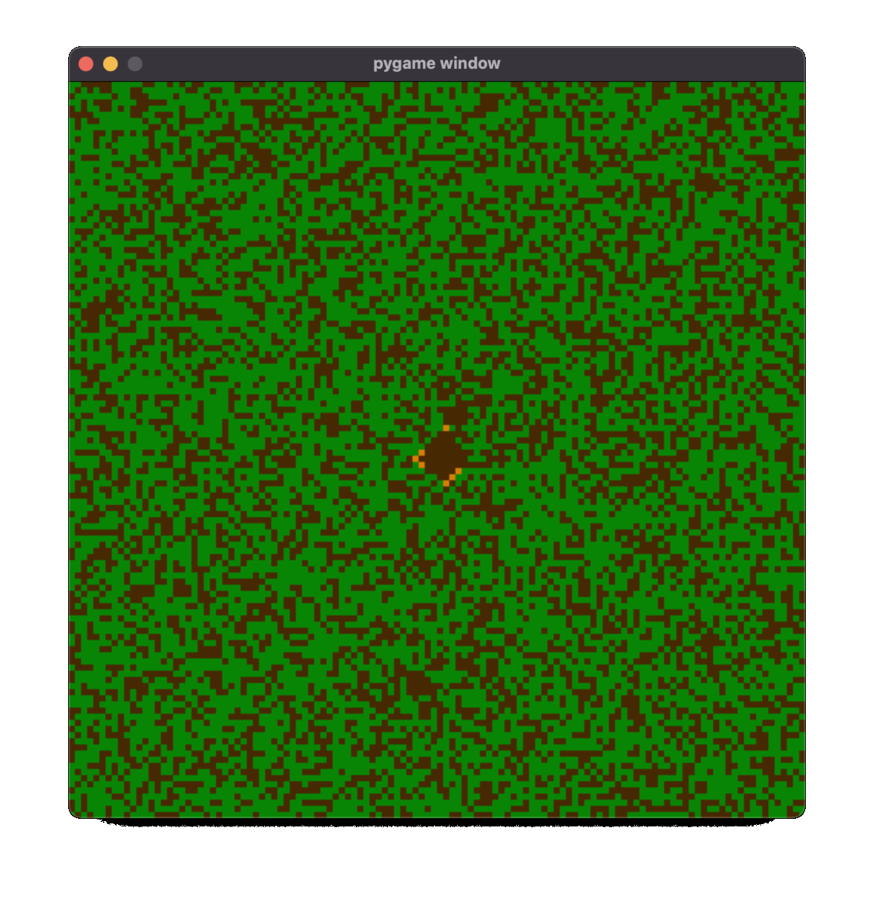
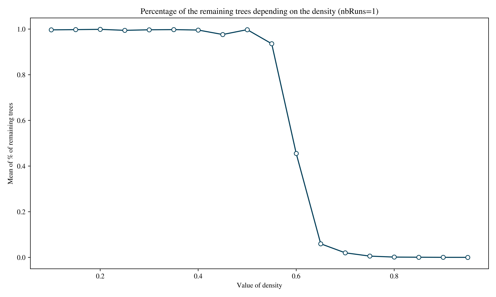
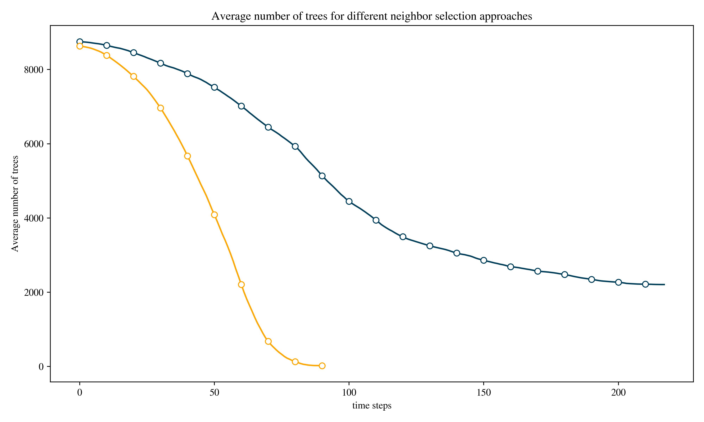

# forest-fire
Studying a forest fire model defined as a two-dimensional cellular automaton on 
a grid of cells. 

# Improvements and functionalities
The implemented cellular automata represents a simulation of 
the spread of fire through a forest. A cell can have one of the
following values:

- `TREE = 1`: if the cell contains a tree
- `FIRE = -5`: if the cell is burning, only cells that had a tree 
in the previous time step can burn, the conditions of burning are specified later. 
- `EMPTY = 0`: if the cell does not contain a tree.

Two types of neighborhoods are implemented:
- `Von Neumann`: for a cell at position `(i, j)`, the neighbors are:
  - the cell above (the cell at the position `(i-1, j)`)
  - the cell below (the cell at the position `(i+1, j)`)
  - the cell on the left (the cell at the position `(i, j-1)`)
  - the cell on the right (the cell at the position `(i, j+1)`)
- `Moore`: for a cell at position `(i, j)`, the neighbors are:
  - The `Von Neumann` neighbors.
  - the cell on the top left (the cell at the position `(i-1, j-1)`)
  - the cell on the top right (the cell at the position `(i-1, j+1)`)
  - the cell on the bottom left (the cell at the position `(i+1, j-1)`)
  - the cell on the bottom right (the cell at the position `(i+1, j+1)`)

> **Note:** Some neighbors may not exist if the indexes are out of bound.

The files `forest.py` contains a `main`function that allows to visualize
a forest fire simulation with `Von Neumann` neighbors using a density 
value of `density=0.6`, these parameters can, of course, be changed.

The notebook `notebook.ipynb` contains the following tests : 
- A function `remaining_trees_per_density` that is used to plot to 
calculate and plot the percentage of the remaining trees depending on the 
density. In order to avoid getting biased values because of 
the `random` function. The percentages are averaged over a number of runs
`nb_runs=100`. The plot shows that the percentage of the remaining trees drops drastically
starting for a density value of `density≈0.5`.

- A function `comparing_neighbors_types` to help compare how the number 
of trees decreases when using the two different approaches of calculating 
the neighbors. This function does multiple runs to avoid biased values.
The plot shows the results obtained for a fixed density (`density=0.6`).

# Additional changes as to the initial version
In addition to all the previous functionalities :

- The code has been cleaned to follow the `PEP-8` style guidelines.